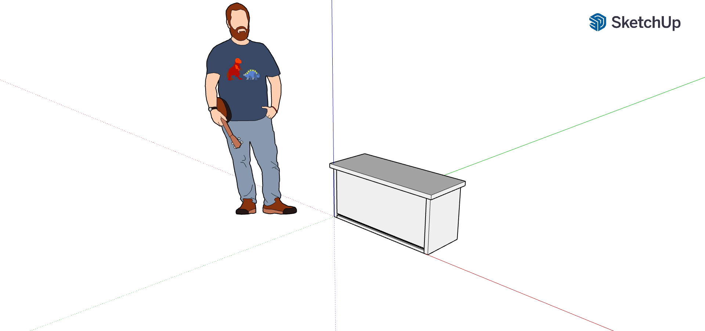
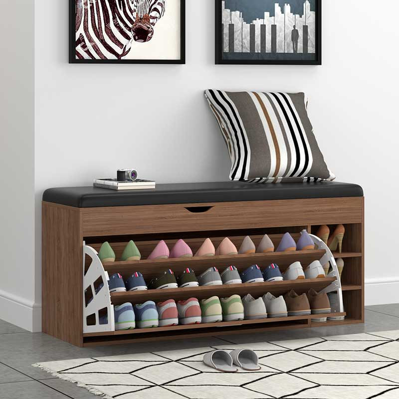
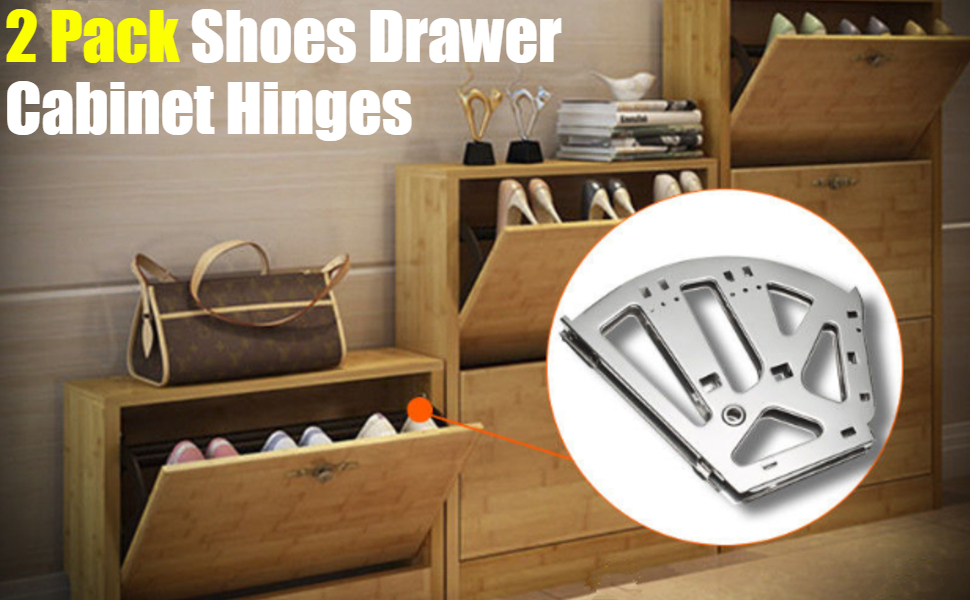
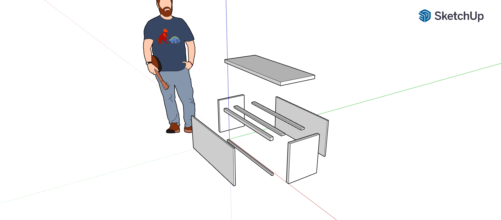
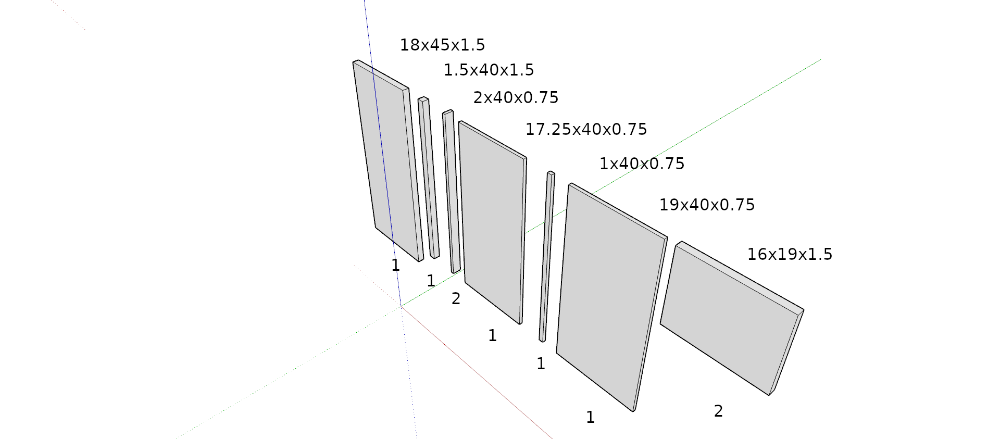
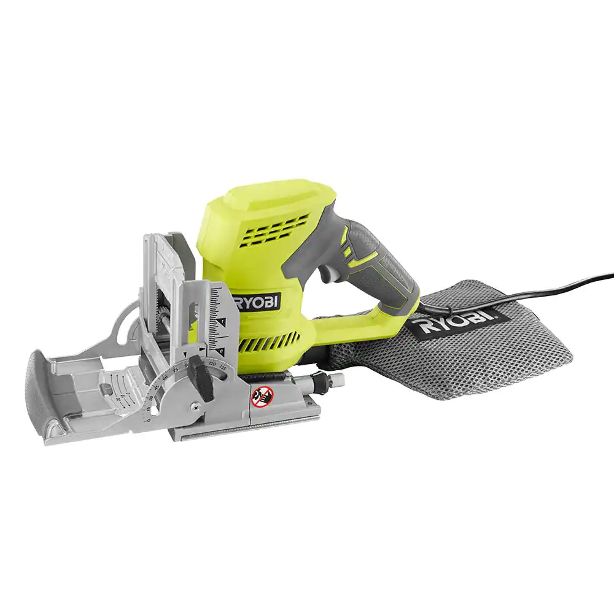
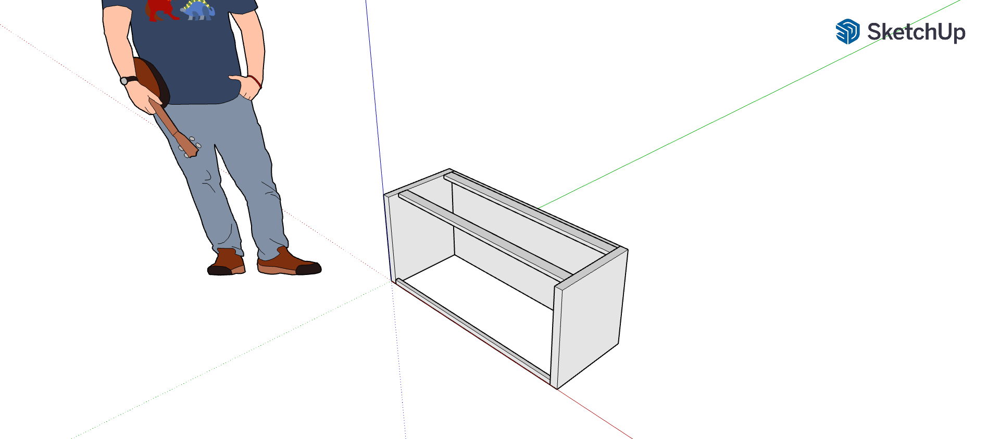
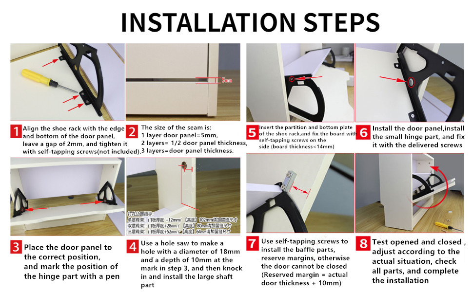
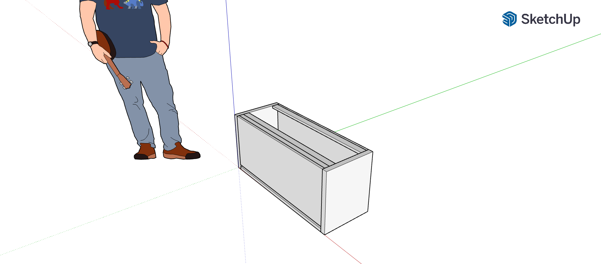
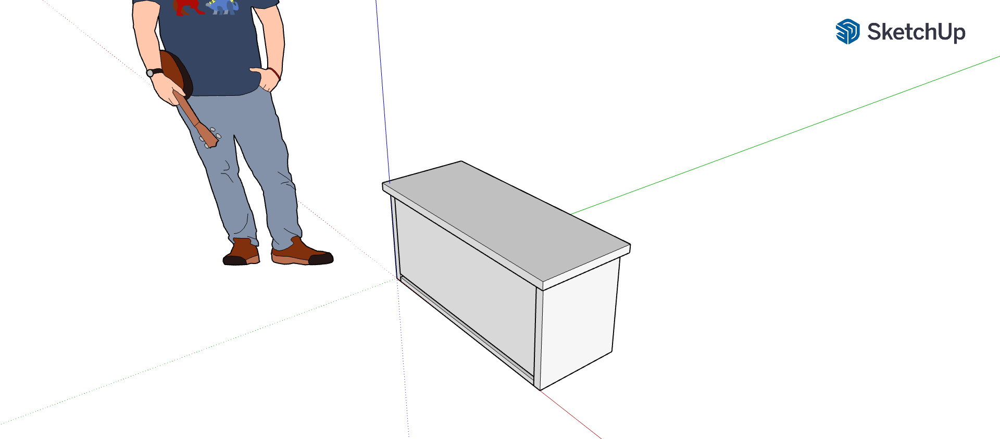

# Holly's Shoe Bench Christmas Project
### Description
As a Christmas gift, we'll be building a bench with shoe storage. The shoe storage will tip out making use of hidden shoe drawer hardware. The drawer will remain latched using magnets.  
Perspective:


Inspiration:


Hinges:


### Construction
```
NOTE: To get precise piece locations, open the SketchUp project and use the tape measure tool.
```
The shoe bench carcas will be made of 9 pieces of hard maple.


**The Cut List**  
The carcas cut list is as follows:  
| Quantity | Width | Depth | Height |
|----------|-------|-------|--------|
|     1    |   45" |  18"  |   1.5" |
|     1    |   40" |  1.5" |   1.5" |
|     2    |   40" |  2"   |  0.75" |
|     1    |   40" |17.25" |  0.75" |
|     1    |   40" |  1"   |  0.75" |
|     1    |   40" |  19"  |  0.75" |
|     2    |   19" |  16"  |   1.5" |

  

1. Panels with a depth > 6" will need to be jointed, glued together and kept in alignment with biscuits. 

2. Start by attaching the 2 sides (19" x 16" x 1.5") to the supports and back of the bench with pocket screws.

3. Attach the drawer stop to the top front of the bench carcas using pocket screws.

4. Install the hinges to the door front and the door to the bench.


5. Attach the bench top to the carcas, securing through the 2" wide support braces at the top

6. Drill out locations for the magnets on the 1.5" drawer stop and attach magnets with a screwdriver and provided screws.